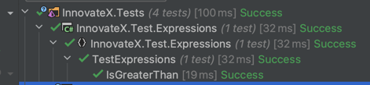

# 1.3 Expressions and operators

In C#, an expression is a combination of one or more values, variables, and operators that can be evaluated to a single value. Expressions are used to perform calculations, assign values to variables, and control the flow of a program.

Here are some examples of expressions in C#:

```bash
1 + 2           // Addition
3 - 1           // Subtraction
4 * 2           // Multiplication
8 / 4           // Division
x > y           // Comparison (greater than)
x < y           // Comparison (less than)
x == y          // Comparison (equal to)
x != y          // Comparison (not equal to)
x = y + z       // Assignment
```

In C#, there are various types of operators that can be used in expressions, including arithmetic operators, comparison operators, assignment operators, and logical operators.

Here are some examples of the different types of operators in C#:

**Arithmetic operators**: +, -, *, /, % (modulus)

**Comparison operators**: >, <, >=, <=, ==, !=

**Assignment operators**: =, +=, -=, *=, /=, %=

**Logical operators**: &&, ||, !

## Math Checker
Let's create a new Library, adding it to our existing Libraries folder.


Now as we have done before, lets create a new test for a function that returns TRUE if a number is greater than.

First let's create a new project for our expressions that we will be testing.


Here is are starting point.

```csharp
public class TestExpressions
{
    [Fact]
    public void IsGreaterThan()
    {
        
    }
}
```
As we stated before we are going to create a new test for a function that returns TRUE if a number is greater than.

Using are flow of `arrange` ,`act` and `assert` lets code this up.

```csharp
 [Fact]
    public void IsGreaterThan()
    {
        // arrange
        var isGreaterThan = MathChecker.IsGreater(100, 50);

        // act
        var greater = 100 < 50;

        // assert
        Assert.Equal(greater, isGreaterThan);

    }
```

As we saw before we will get an error about the references so we will need to add those.


Now we see that are test are complaining about the following. We will need to create this missing function.
```bash
TestExpressions.cs(11, 41): [CS0117] 'MathChecker' does not contain a definition for 'IsGreater'
```

We can also add this quickly by using the intelligence of our IDE.


Now we can see that this function was added under our `MathChecker.cs`


Now let's give our tests a go! When running our test will see that the exception is being thrown "We will learn more about Exception down the road"; exceptions are a mechanism in programming languages that allow the program to handle runtime errors or abnormal conditions. When an exception occurs, it disrupts the normal flow of the program's instructions. In some programming languages, exceptions are used to handle errors or exceptional conditions that may occur during the execution of a program.

```bash
System.NotImplementedException: The method or operation is not implemented.
```

Let's correct the exception. and something to our function.

```csharp
    public static bool IsGreater(int i, int i1)
    {
        return false;
    }
```

Now we run our test we can see it failing show us that it was expecting `True`. Let's correct this function so that we are able to get a passing test result.

```csharp
 public static bool IsGreater(int i, int i1)
    {
        return i > i1;
    }
```

And our test is passing!



Try adding some test of your own test for `isLessThan` and see if you can get a passing test result, using the TDD workflow we have been using!

