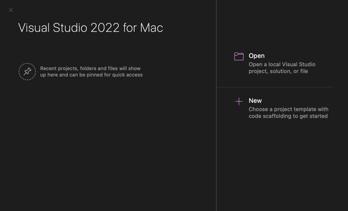
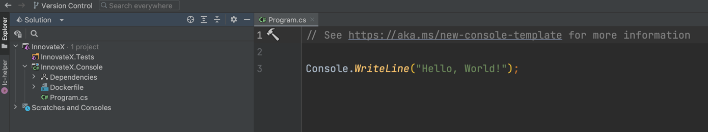

# 1.0 Getting started with C-Sharp

Installing `C#` on your local machine.

`C#` (pronounced "C sharp") is a programming language developed by Microsoft. It is a general-purpose, object-oriented language that is designed to be easy to use, modern, and powerful. `C#` is widely used for building a variety of applications, including desktop applications, mobile apps, and web apps.

.NET is a software framework developed by Microsoft that provides a runtime environment and a set of libraries for building and running applications. It supports multiple programming languages, including `C#`.

In other words, `C#` is a programming language and `.NET` is a software framework that you can use to build applications. You can use `C#` to write the code for your application, and .NET provides the tools and infrastructure you need to build, run, and deploy the application.

While `C#` and .NET are often used together, they are not the same thing. You can use `C#` with other frameworks, and you can use other programming languages with .NET.

As of December 2022, `.NET` 6.0 is the LTS(Long Term Support) version. Click on the following link to install .NET on your local machine.

[.NET Installation](https://dotnet.microsoft.com/en-us/download)

`C#` is a modern, object-oriented programming language developed by Microsoft. It is designed to be easy to use, powerful, and flexible. Here are some of the key features of `C#` syntax:

- **Types**: `C#` has a variety of built-in types, such as integers, floating-point numbers, and strings, as well as support for user-defined types.

- **Variables**: `C#` uses variables to store values in memory. Variables have a type, which determines the kind of data they can store, and a name, which allows you to refer to them in your code.

- **Expressions and operators**: `C#` supports a wide range of operators, including arithmetic, logical, and comparison operators, that you can use to build expressions.

- **Control structures**: `C#` provides various control structures, such as if-else statements, for loops, and while loops, that allow you to control the flow of your code.

- **Functions**: `C#` supports the use of functions, which are blocks of code that can be called by name. Functions can take parameters and return a value.

- **Classes and objects**: `C#` is an object-oriented language, which means it allows you to define classes and create objects based on those classes. A class is a template that defines the properties and behaviors of an object, and an object is an instance of a class.

- **Interfaces**: `C#` allows you to define interfaces, which are collections of related methods that a class can implement. An interface specifies the behavior of an object, but not the implementation.

These are just a few of the key features of `C#` syntax. There are many other aspects of `C#` syntax, such as namespaces, exceptions, and attributes, that you can learn about as you continue to work with the language.

## Settings up our IDE.

During this introduction we will be using an IDE. if you have Jet Brains Rider "Which I prefer" 😎, or Visual Studio that will work as well.

[MacOS Install For Visual Studio](https://visualstudio.microsoft.com/vs/mac/)

[Windows Install For Visual Studio](https://visualstudio.microsoft.com/vs/)



Now we are up and running!! 👟

Now let's create a blank solution using Visual Studio. This may look different depending on you operating system.
We can think of a solution as a container for our code. We are going to be adding multiple projects to our solution as we go.

So there are two ways that we are able to create a solution one being through the Visual Studio and the other is through the dotnet cli.
During these fundamentals we will be using the CLI from time to time for our operations.

Our fake company name that we will be using is called `InnovateX` there creating cool stuff over there.
Using the following commnad will create a new .NET solution in the folder you are in.
```bash
dotnet new sln -n InnovateX
```
Now open this op in your IDE; Once we are in here we are going to create a new project and name it `InnovateX.Console`

Viola!


Up next, we will learn about Types using `C#`.