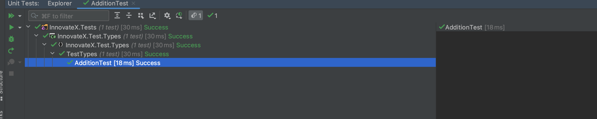

# 1.2 Types And Variables

`C#` is a type-safe, object-oriented programming language that is widely used for building a range of applications, including web, mobile, desktop, and games. `C#` has a rich set of data types that you can use to store and manipulate data in your program.

In `C#`, there are two main categories of data types: value types and reference types.

## Value types include:

**Integral types**: sbyte, byte, short, ushort, int, uint, long, and ulong

**Floating-point types**: float and double

**Decimal type**: decimal

**Boolean type**: bool

**Character type**: char

**Reference types include**:

- String type: string
- Object type: object
- Dynamic type: dynamic

`C#` also has a special type called var, which allows you to declare a variable without specifying its type. The type of the variable will be inferred from the expression used to initialize it.

For example:

```csharp
int x = 10;          // x is of type int
double y = 10.5;     // y is of type double
string s = "Hello";  // s is of type string
var z = 10;          // z is of type int
```
It's important to choose the right data type for your variables, as it determines how much memory the variable will consume and how the value will be stored and manipulated in your program.

## Variables
In C#, a variable is a storage location for holding a value. A variable has a name, a type, and a value. The type of a variable determines what kind of value it can store, such as an integer, a floating-point number, or a string.

Here's an example of how to declare and use a variable in C#:

```
int age;  // Declare a variable named "age" of type int
age = 30; // Assign a value of 30 to the variable

Console.WriteLine(age); // Outputs "30"
```
In the example above, we declare a variable named age of type int, which stands for "integer." An integer is a whole number, positive or negative, without a decimal point.

We then assign a value of 30 to the age variable using the assignment operator =.

Finally, we use the Console.WriteLine() method to print the value of the age variable to the console.

You can also declare and assign a value to a variable in a single line, like this:

```
int age = 30;
```
You can also declare multiple variables of the same type in a single line, like this:

```
int num1, num2, num3;
```
Or you can declare and assign values to multiple variables of the same type in a single line, like this:

```
int num1 = 10, num2 = 20, num3 = 30;
```

It's important to choose descriptive and meaningful names for your variables to make your code easier to read and understand. In C#, variable names are case-sensitive and must begin with a letter, an underscore, or a dollar sign. They can contain letters, digits, and underscores, but they cannot contain spaces or other special characters.


Alright, now let's create a new project on our .NET solution. In the last lesson we created a folder where we will be storing all of our test projects.

```bash
# Create Project
dotnet new xunit -n InnovateX.Test.Types

#Add project to solution folder
dotnet sln InnovateX.sln add InnovateX.Test.Types --solution-folder InnovateX.Tests
```
We can see that we have all of our files in order.


## Calculate Function

Now let's create our first test. 

```csharp
 [Fact]
    public void AdditionTest()
    {
        // arrange
        var add = TypesVariables.Calculate.Addition(1, 2);
        
        // act
        var sum = 3;

        // assert
        Assert.Equal(sum, add);
    }
```

If we take a look at this test, we can see that we are adding two numbers together and returning the result. If we run this test we will notice that we are not getting a passing one. 

```bash
[CS0103] The name 'TypesVariables' does not exist in the current context
  ```

This is because we have not created this code as of yet! 


### Addition
let's create this Calculate function.

```bash
#Create the new library containing our code
dotnet new classlib -o InnovateX.TypesVariables

#Let's add this to a folder as well
dotnet sln InnovateX.sln add InnovateX.TypesVariables --solution-folder InnovateX.Libraries
```

Let's also clean this up and rename the default file name it give us to `Calculate.cs`

Now let's create a function to calculate the values.
 > Don't worry if you do not know what or how functions work, we will dive into these at a later time in detail. For now you can just follow along.

```bash
namespace InnovateX.TypesVariables;
public class Calculate
{
    public static int Addition(int num1, int num2)
    {
        return num1 + num2;
    }
}

```

Moving back over to our test, One more thing we can see if that we are getting an error.


This is the code saying that it does not know how to reach or find this Function. If we right-click on the function.


we can see the actions that are available to us. Let's add the following reference!


Now let's see what our test is showing.

Running all tests.




Huzzah! 🎉 We have passed all tests. Let's keep going!

### Subtraction

Now we have created the Subtraction function.

```csharp
[Fact]
    public void SubtractionTest()
    {
        // arrange
        var sub = Calculate.Subtraction(2, 4);

        // act
        var sum = 2;

        // assert
        Assert.Equal(sum, sub);

    }
```

When running our test we see that we are getting an error
```angular2html
[CS0117] 'Calculate' does not contain a definition for 'Subtraction'
```

This is happening because we have not created our `Subtraction` function in our `Calculate.cs`` file, let us add that now.

```csharp
public static int Subtraction(int num1, int num2)
{
    return num1 - num2;
}
```

Now we can rerun our tests.
```bash
# Running this command we can also run our tests.
dotnet test
Passed!  - Failed:     0, Passed:     2, Skipped:     0, Total:     2, Duration: 5 ms - InnovateX.Test.Types.dll (net7.0)
```
Nice we are passing our test now. Let do it again for Division.

### Division

As we are use to by now, we are going to create our test, which at this point will fail.

```csharp
[Fact]
    public void DivisionTest()
    {
        // arrange
        var sub = Calculate.Division(10,2);

        // act
        var sum = 5;

        // assert
        Assert.Equal(sum, sub);

    }
```

With our falling test lets add the code so we are able to get this to pass.

```csharp
public static int Division(int num1, int num2)
{
    return num1 / num2;
}
```

And there you have it! passing tests all around.

```bash
# Run test using the dotnet cli
dotnet test

#output
Passed!  - Failed:     0, Passed:     3, Skipped:     0, Total:     3, Duration: 6 ms - InnovateX.Test.Types.dll (net7.0)
```
I hope this gives you a good introduction to `C#` data types. Next we will look at Expressions and operators.


